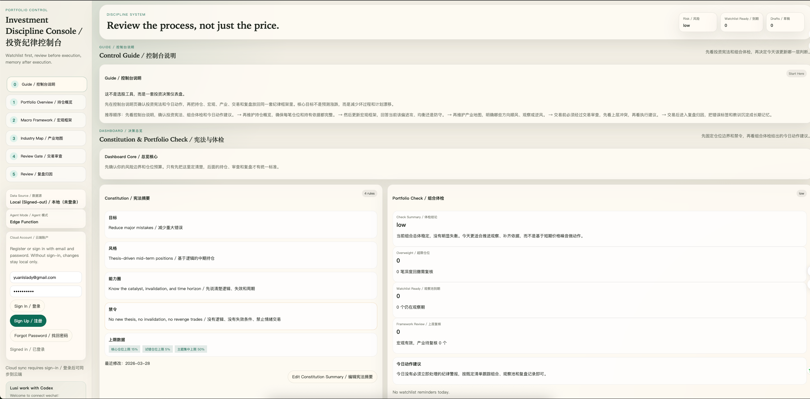

# RiskControl / 投资纪律与风控工作台

一个面向个人专业投资者的“流程化风控/交易纪律”前端应用：用更清晰的结构把**持仓 → 交易审查 → 投前纪要 → 投后复盘 → 事件记录**串起来，并支持通过 **Supabase Edge Function** 统一代理调用模型（Memo 生成 + 截图 OCR 导入）。

## 在线体验

- Demo（内置示例数据，可直接体验流程）：`https://riskcontrol-demo.vercel.app`
- 真实测试版（可注册登录，使用自己的数据）：`https://riskcontrol-app.vercel.app`

## 主要能力

- 数据源：演示数据 / 未登录本地 / 登录后 Supabase 云端
- 持仓管理、关注池、事件记录、复盘归因
- 投前纪要（Pre-trade Memo）与投后复盘（Post-trade Memo）
- 券商截图 OCR 导入（经 Edge Function 代理）
- 规则引擎与流程化检查项（减少“凭感觉交易”）

## 项目结构

```text
src/                      前端 React 代码
supabase/schema.sql       Supabase 数据库 schema（含 RLS）
supabase/functions/       Edge Functions（memo 生成、OCR 导入等）
docs/screenshots/         README 截图占位目录
```

## 本地运行

### 1) 安装依赖

```bash
npm install
```

### 2) 配置环境变量

复制示例文件并填写：

```bash
cp .env.example .env.local
```

至少需要：

```env
VITE_SUPABASE_URL=...
VITE_SUPABASE_ANON_KEY=...
VITE_AGENT_FUNCTION_NAME=investment-agent
VITE_PUBLIC_DEMO_MODE=false
```

### 3) 启动开发环境

```bash
npm run dev
```

## Supabase 配置（数据库 / Auth / Edge Function）

完整步骤见：

- `DEPLOY.md`
- `AGENT_SETUP.md`
- `FRIEND_TEST_CHECKLIST.md`

## 截图占位

- `docs/screenshots/riskcontrol_dashboard.png`
- `docs/screenshots/riskcontrol_macro_framework.png`
- `docs/screenshots/riskcontrol_industry_map.png`
- `docs/screenshots/riskcontrol_trading_review.png`



## Roadmap

见 `ROADMAP.md`。

## License
MIT License（见 `LICENSE`）。
